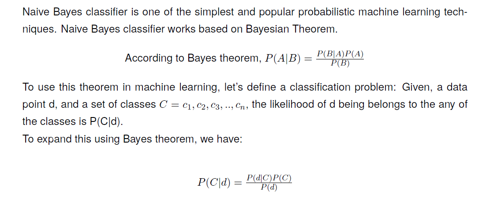
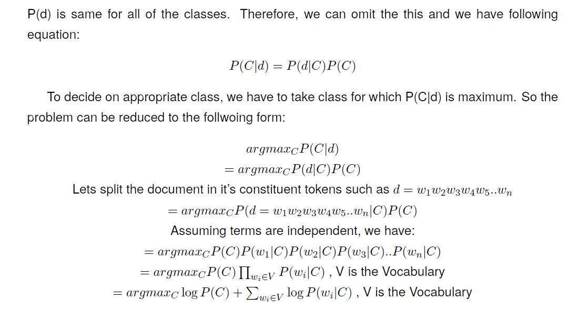
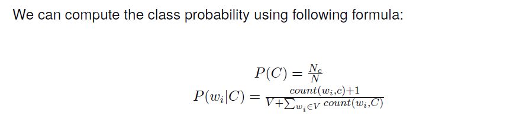
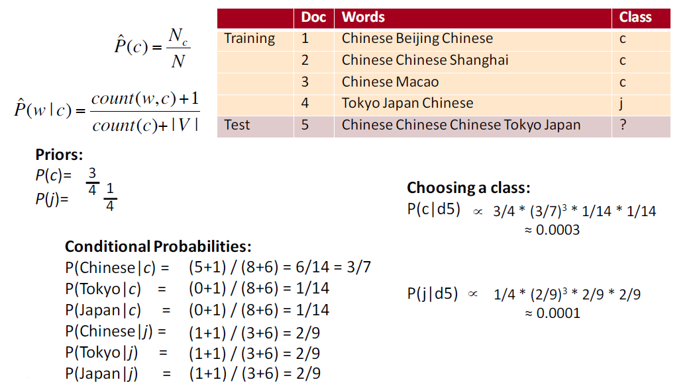

Multinomial\_Naive\_Bayes
=========================

A worked example is given below

 
Here is the Training.csv `link <https://github.com/Shauqi/Machine-Learning-Lab/blob/master/Naive%20Bayes/Training.csv/>`_.

Be sure to store it in the same directory or edit the code according to your file path. 

Here is the code implementation of Multinomial Naive Bayes::

	import csv
	import math

	class Multinnomial_Naive_Bayes(object):
	    '''
	    Multinomial Naive Bayes Classifier.

	    chinese_data : list
	                    For holding strings of chinese Class
	    japanese_data : list
	                     For holding strings of Japanese Class
	    prior_prob_c : float
	                    Calculated Prior Probability of Chinese Class
	    prior_prob_j : float
	                    Calculated Prior Probability of Japanese Class
	    llh_c : dict
	             count of each word in Chinese Class is saved as {word: count(word)}
	    llh_j : dict
	             count of each word in Japanese Class is saved as {word: count(word)}
	    words_in_c: int
	                 Total words in Chinese Class
	    words_in_j: int
	                 Total words in Japanese Class
	    v_count: int
	              Number of different words
	    '''
	    def __init__(self):
	        self.chinese_data = []
	        self.japanese_data = []
	        self.prior_prob_c = 0
	        self.prior_prob_j = 0
	        self.llh_c = {}
	        self.llh_j = {}
	        self.words_in_c = 0
	        self.words_in_j = 0
	        self.v_count = 0

	    def Prior_Probability(self, filename):
	        '''
	        Estimates Prior Probability of each class

	        filename : 
	        			csv file of Training Dataset
	        return : self
	        '''
	        cCount = 0
	        jCount = 0
	        with open(filename) as docs:
	            doc = csv.reader(docs, delimiter=',')
	            for row in doc:
	                if row[1] == 'c':
	                    self.chinese_data.append(row[0])
	                    cCount += 1
	                else:
	                    self.japanese_data.append(row[0])
	                    jCount += 1
	        self.prior_prob_c = cCount/(cCount+jCount)
	        self.prior_prob_j = jCount/(cCount+jCount)

	    def likelihood(self):
	        '''
	        Estimates Likelihood of each word of each class

	        return: self
	        '''
	        for row in self.chinese_data:
	            for word in row.split():
	                if word in self.llh_c:
	                    self.llh_c[word] += 1
	                else:
	                    self.llh_c.update({word:1})
	                    self.v_count += 1
	                self.words_in_c += 1

	        for row in self.japanese_data:
	            for word in row.split():
	                if word in self.llh_j:
	                    self.llh_j[word] += 1
	                else:
	                    self.llh_j.update({word: 1})
	                    if word not in self.llh_c:
	                        self.v_count += 1
	                self.words_in_j += 1

	    def fit(self, filename):
	        '''
	        Calls Prior_Probability and likelihood function

	        filename : 
	        		   csv file of Training Dataset
	        return : self
	        '''
	        self.Prior_Probability(filename)
	        self.likelihood()

	    def predict(self, str):
	        '''
	        After getting the string it predicts the value and classifies it according to
	        majority rule.

	        str : string 
	        	   Contains test string for prediction
	        return: string 
	        		 returns which class the test string belongs
	        '''
	        prb_in_c = 0
	        prb_in_j = 0
	        for word in str.split():
	            if word in self.llh_c and word in self.llh_j:
	                prb_in_c += math.log10((self.llh_c[word] + 1)/ (self.words_in_c + self.v_count))
	                prb_in_j += math.log10((self.llh_j[word] + 1)/ (self.words_in_j + self.v_count))
	            elif word in self.llh_c and word not in self.llh_j:
	                prb_in_c += math.log10((self.llh_c[word] + 1) / (self.words_in_c + self.v_count))
	                prb_in_j += math.log10(1 / (self.words_in_j + self.v_count))
	            elif word not in self.llh_c and word in self.llh_j:
	                prb_in_c += math.log10(1 / (self.words_in_c+self.v_count))
	                prb_in_j += math.log10((self.llh_j[word] + 1)/ (self.words_in_j + self.v_count))
	            else:
	                prb_in_c += math.log10( 1 / (self.words_in_c + self.v_count))
	                prb_in_j += math.log10( 1 / (self.words_in_j + self.v_count))

	        prb_in_c += math.log10(self.prior_prob_c)
	        prb_in_j += math.log10(self.prior_prob_j)

	        if prb_in_c > prb_in_j:
	            return "Class: Chinese"
	        else:
	            return "Class: Japanese"

	if __name__ == '__main__':
	    nb = Multinnomial_Naive_Bayes()
	    nb.fit('Training.csv')
	    print(nb.predict("Chinese Chinese Chinese Tokyo Japan"))

.. automodule:: Multinomial_Naive_Bayes
    :members:
    :undoc-members:
    :show-inheritance:

